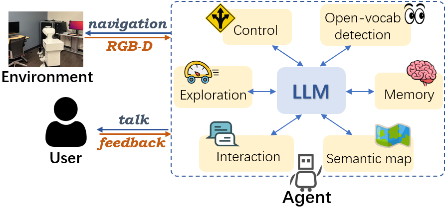

# ORION Framework for Open-World Interactive Personalized Robot Navigation
Paper: [Think, Act, and Ask: Open-World Interactive Personalized Robot Navigation](https://arxiv.org/pdf/2310.07968.pdf)

We propsoe a general framework for Open-woRld Interactive persOnalized Navigation (ORION) that uses Large Language Models (LLMs) to make sequential decisions to manipulate different modules, so the robot can search, detect and navigate in the environment and talk with the user in natural language.



## Installation

Git clone the project and cd to the project main directory.

1. Install habitat-sim. We use [0.2.2](https://github.com/facebookresearch/habitat-sim/tree/v0.2.2#installation) version.
```
conda create -n <name> python=3.7 cmake=3.14.0
conda activate <name>
conda install habitat-sim==0.2.2 withbullet headless -c conda-forge -c aihabitat
```

2. Install pytorch. We use 1.13.1+cu117 version. But you can change the version according to your own cuda version.
```
conda install install pytorch==1.13.1 torchvision==0.14.1 torchaudio==0.13.1 pytorch-cuda=11.7 -c pytorch -c nvidia
```

3. Install submodules
```
git submodule update --init --recursive
```

- 3.1. habitat-lab. We use [0.2.2](https://github.com/facebookresearch/habitat-lab/tree/v0.2.2#installation) version.
```
cd third_party/habitat-lab/
pip install -r requirements.txt
python setup.py develop --all
```

- 3.2. Install dependency for [LSeg](https://github.com/isl-org/lang-seg/tree/main), [openclip](https://github.com/mlfoundations/open_clip), openai chatgpt api and other dependencies.
```
cd <project_main_dir>
pip install -r requirements.txt
```

- 3.3. Install [GroundingSAM](https://github.com/IDEA-Research/Grounded-Segment-Anything#install-without-docker)
```
cd third_party/Grounded-Segment-Anything
export AM_I_DOCKER=False
export BUILD_WITH_CUDA=True
export CUDA_HOME=/path/to/cuda-11.7/    # make sure this cuda version is same as pytorch cuda version

python -m pip install -e segment_anything
python -m pip install -e GroundingDINO
```

4. Finally, install the project itself
```
cd <project_main_dir>
python setup.py develop
```

## Data
Build a `data` directory in the project main directory. The structure of the data folder should be as follows:
```
.
├── data
│   ├── datasets                  # soft link to habitat-lab/data/
│   │   └── objectnav_hm3d_v2
│   ├── experiments               # experment results save_dir
│   ├── pretrained_ckpts          # pretrained model checkpoints
│   │   ├── groundingdino_swint_ogc.pth
│   │   ├── lseg_demo_e200.ckpt
│   │   └── sam_vit_h_4b8939.pth
│   └── scene_datasets            # soft link to habitat-lab/data/scene_datasets
│       └── hm3d_v0.2
├── demos
├── orion
├── README.md
├── requirements.txt
├── scripts
├── setup.py
├── tests
└── third_party
```
### Habitat Data
We use (Habitat HM3D dataset)[https://github.com/matterport/habitat-matterport-3dresearch]. Please apply through the website for permission.
After downloading the HM3D v0.2, add soft link to the `data/scene_datasets/hm3d_v0.2` following the [data practice](https://github.com/facebookresearch/habitat-lab/blob/main/DATASETS.md) of habiat-lab.
Downlaod objectnav_hm3d_v2 dataset and save it to  `data/datasets/objectnav_hm3d_v2`.

In our experiment, we use `4ok3usBNeis, MHPLjHsuG27, mL8ThkuaVTM, QaLdnwvtxbs, TEEsavR23oF, qyAac8rV8Zk, h1zeeAwLh9Z, cvZr5TUy5C5, LT9Jq6dN3Ea, y9hTuugGdiq` 10 scenes from the val set.

### Pre-trained Model Checkpoints
1. Download SAM [ckpt](https://github.com/IDEA-Research/Grounded-Segment-Anything/tree/main/segment_anything#model-checkpoints) `sam_vit_h_4b8939.pth` to `data/pretrained_ckpts/sam_vit_h_4b8939.pth`.

2. Download grounding-dino [ckpt](https://github.com/IDEA-Research/Grounded-Segment-Anything/tree/main#running_man-grounded-sam-detect-and-segment-everything-with-text-prompt)  `groundingdino_swint_ogc.pth` to `data/pretrained_ckpts/groundingdino_swint_ogc.pth`.

3. Download Lseg [ckpt](https://github.com/isl-org/lang-seg/blob/main/requirements.txt#download-demo-model) to `data/pretrained_ckpts/lseg_demo_e200.ckpt`.

## ChatGPT API key
We use OpenAI's ChatGPT for the chatbot, using either Azure or OpenAI's API.
Please edit the `orion/config/chatgpt_config.py` with your own api keys.

## Run
1. `cd <project_main_dir>`. All python scripts should be run in the project main directory.
2. `python scripts/collect_scene_fbe.py --scene_id==<scene_id>` to collect rgbd frames in habitat scenes using frotier-based exploration. You can set args to decide which scenes to collect. Optional: use `scripts/create_video.py` to create video from the collected frames.
3. `python scripts/build_vlmap.py --scene_id=<scene_id> --feature_type=lseg` to build vlmap for each scene. It takes 30 min for LSeg and 60min for ConceptFusion to build one scene (around 500 frames).
4. Now after set your openai api key in `orion/config/chatgpt_config.py` and prepare the data and pre-trained model ckpts, you can directly run `python demos/play_interactive_terminal.py` to talk with ORION in the terminal.
5. After build VLMap or ConceptFusionMap for the scenes, you can run complete experiments:
 - `python scripts/user_agent_talk_orion.py` run the ORION method
 - `python scripts/user_agent_talk_cow.py` run the CoW method
 - `python scripts/user_agent_talk_vlmap.py` run the VLMap method
 - `python scripts/user_agent_talk_cf.py` run the Conceptfusion method

 Make sure to set suitable arguments and the chatgpt config for both the user simulator and the agent.


## Demo
1. To test the chagpt api, you can try to run `python demos/play_chatgpt_api.py` to talk with the chatbot. Need to set your openai api key in `orion/config/chatgpt_config.py`.
2. To test the LSeg model, you can run `python demos/play_lseg.py` to see the LSeg model in action.
3. To test the GroundingSAM model, you can run `python demos/play_groundingSAM.py` to see the GroundingSAM model in action.
4. To test GradCAM, you can run `python demos/play_gradcam.py` to see the GradCAM in action.
5. To play with keyboard control, you can run `python demos/play_habitat_teleop.py` to control the agent with keyboard in the habitat-sim window, where "w/s/a/d/p" denotes forward/backward/left/right/finish.
6. To play with a Gradio GUI, you can run `python demos/play_interactive_gradio.py` with orion agent. You can interactive with the agent in natural language and see the agent's response and actions.


# Trouble Shooting
1. If the model downloading is very slow, it might be the network issue of IPV6 connect. Try to disble the IPV6
```
sudo sysctl -w net.ipv6.conf.all.disable_ipv6=1
```
2. The LSeg model can only process certain size of image, try to resize the image to HxW=480x640.
3. If GroundingDINO is not installed successfully, you can try to build and install it manually
```
cd third_party/Grounded-Segment-Anything/GroundingDINO
python setup.py build
python setup.py install
```


# Citation
```
@article{dai2023think,
  title={Think, act, and ask: Open-world interactive personalized robot navigation},
  author={Dai, Yinpei and Peng, Run and Li, Sikai and Chai, Joyce},
  journal={ICRA},
  year={2024}
}
```

# Acknowledgement
This work is supported by Amazon Consumer Robotics, NSF IIS-1949634, NSF SES-2128623, and has benefited from the Microsoft Accelerate Foundation Models Research (AFMR) grant program.
